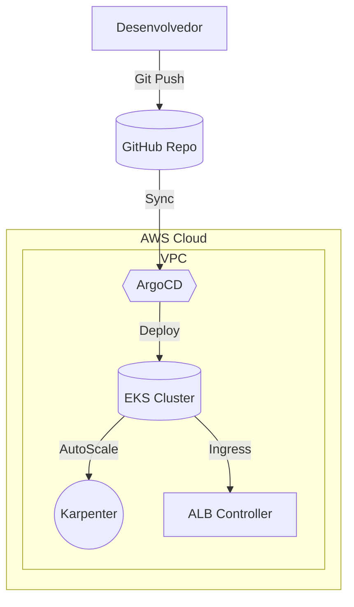

# 🚀 EKS ADM Full

[](https://www.terraform.io/)
[](https://kubernetes.io/)
[](https://aws.amazon.com/)
[](https://argo-cd.readthedocs.io/)
[](LICENSE)

---

## 📌 Visão Geral

O **EKS ADM Full** é um projeto de **Infraestrutura como Código (IaC)** que provisiona e gerencia um cluster **Amazon EKS** completo utilizando **Terraform**.  
A solução segue práticas modernas de **GitOps** com **ArgoCD**, inclui **Karpenter** para provisionamento dinâmico de nós, e utiliza o **ALB Controller** para gerenciar ingressos no Kubernetes.  

---

## 🏗️ Arquitetura



---

## 📂 Estrutura do Repositório

```
eks-adm-full/
│── modules/               # Módulos Terraform reutilizáveis
│   ├── alb-controller/    # Configuração do AWS ALB Ingress Controller
│   ├── argocd/            # Configuração do ArgoCD
│   ├── eks/               # Criação do cluster EKS
│   ├── karpenter/         # Configuração do Karpenter
│   ├── kube-stack/        # Componentes básicos do Kubernetes
│   ├── vpc/               # Rede (VPC, subnets, roteamento, etc.)
│
│── hom.tfvars             # Variáveis para ambiente de homologação
│── prod.tfvars            # Variáveis para ambiente de produção
│── main.tf                # Chama os módulos principais
│── provider.tf            # Configuração do provedor AWS
│── variables.tf           # Declaração de variáveis globais
│── inflaye.yaml           # Manifestos adicionais de configuração
```

---

## 🚀 Pré-requisitos

- Conta AWS configurada com permissões administrativas  
- Terraform >= 1.5.x  
- kubectl configurado  
- Helm 3 instalado  

Login na AWS (exemplo com AWS CLI):
```bash
aws configure
```

---

## ⚙️ Deploy

### 1. Inicializar o Terraform
```bash
terraform init
```

### 2. Criar e selecionar o workspace do ambiente

- Para **homologação**:
```bash
terraform workspace new hom || terraform workspace select hom
```

- Para **produção**:
```bash
terraform workspace new prod || terraform workspace select prod
```

### 3. Aplicar para homologação
```bash
terraform apply -var-file=hom.tfvars
```

### 4. Aplicar para produção
```bash
terraform apply -var-file=prod.tfvars
```

---

## 🔧 Customização

- Ajuste os parâmetros de subnets, CIDRs e regiões nos arquivos `*.tfvars`.  
- Modifique os módulos dentro de `modules/` para adequar políticas de IAM, versões do Kubernetes e recursos adicionais.  
- O `karpenter` substitui o Cluster Autoscaler e pode ser configurado para Spot e On-Demand instances.  

---

## 📊 Roadmap

- [x] Módulo de VPC  
- [x] Módulo de EKS  
- [x] Módulo de Karpenter  
- [x] Módulo de ALB Controller  
- [x] Integração com ArgoCD  
- [ ] Observabilidade (Prometheus + Grafana)  
- [ ] CI/CD Pipeline automatizado  

---

## 📜 Licença

Este projeto é distribuído sob a licença **MIT**.  
Sinta-se livre para usar, modificar e contribuir.  

---

👉 [Repositório GitHub](https://github.com/wallafidevops/eks-adm-full)
